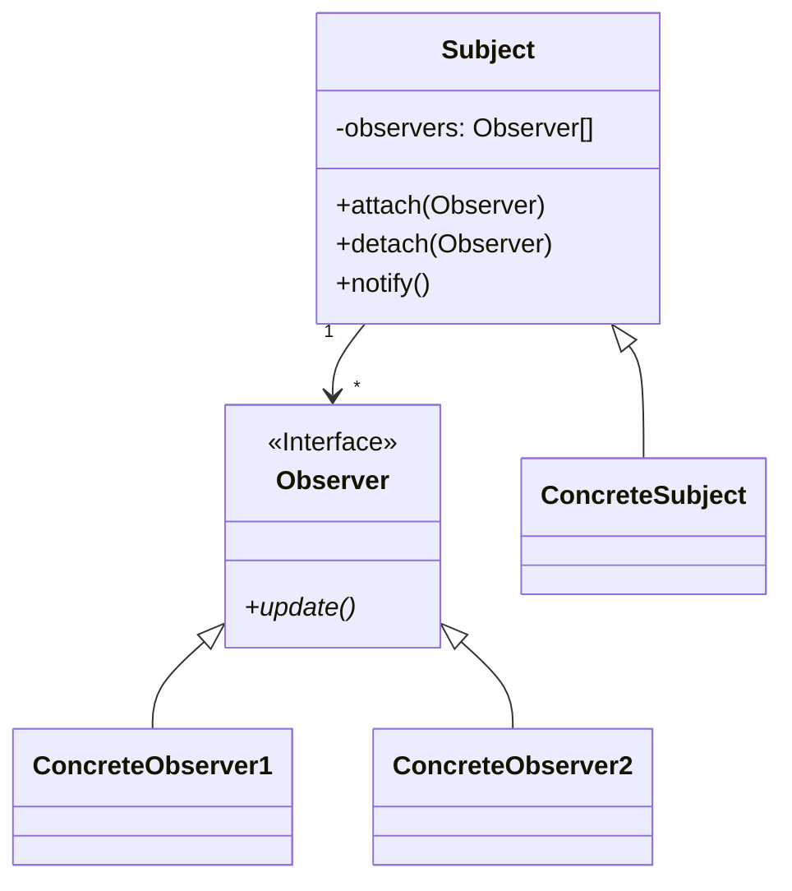

# Lesson: Observer Design Pattern
## Introduction

The Observer Design Pattern is a design pattern used to establish a one-to-many relationship between objects. In this relationship, when one object changes state, all its dependents are notified and updated automatically. The Observer pattern is used extensively in event-driven systems and is particularly useful in decoupling the sender and receiver of events.
## Example Scenario

Suppose we have a weather station that measures the temperature, humidity, and pressure. We want to display this information on a variety of displays, such as a current conditions display, a forecast display, and a statistics display. We need a way for the displays to be notified when the weather data changes, without tightly coupling the displays to the weather station.
## Design

UML Diagram
Here's the UML diagram for the Observer Design Pattern:



+ **Subject**: the object being observed, which maintains a list of its observers and notifies them of any state changes.
+ **Observer**: the interface or abstract class that defines the method(s) that are called when the subject's state changes.
+ **ConcreteSubject**: a subclass of Subject that calls the notify() method when the subject's state changes.
+ **ConcreteObserver**: a subclass of Observer that implements the update() method, which is called by the subject when its state changes.
## Implementation

To implement the Observer Design Pattern, we start by defining the observer interface. The observer interface defines a method for receiving updates:

```c++
template <typename T>
class Observer {
public:
    virtual void update(const T& data) = 0;
};
```

Next, we define the subject abstract class, which maintains a list of observers and provides methods for attaching and detaching observers:

```c++
template <typename T>
class ObservableSubject {
public:
    virtual void attach(std::shared_ptr<Observer<T>> observer) {
        observers.push_back(observer);
    }

    virtual void detach(std::shared_ptr<Observer<T>> observer) {
        observers.erase(std::remove(observers.begin(), observers.end(), observer), observers.end());
    }

    virtual void notify(const T& data) {
        for (const auto& observer : observers) {
            observer->update(data);
        }
    }

private:
    std::vector<std::shared_ptr<Observer<T>>> observers;
};
```

We can then define a concrete subject class that implements the subject interface and maintains the state of the subject:

```c++
class WeatherStation : public ObservableSubject<WeatherStation> {
public:
    struct WeatherInfo {
        float temperature;
        float humidity;
        float pressure;
    };

    void setMeasurements(float temperature, float humidity, float pressure) {
        WeatherInfo data{temperature, humidity, pressure};
        weatherInfo = data;
        notify(*this);
    }

    float getTemperature() const { return weatherInfo.temperature; }
    float getHumidity() const { return weatherInfo.humidity; }
    float getPressure() const { return weatherInfo.pressure; }

private:
    WeatherInfo weatherInfo;
};
```

Finally, we define one or more concrete observer classes that implement the observer interface and maintain state related to the subject:

```c++
class CurrentConditionsDisplay : public Observer<WeatherStation> {
public:
    CurrentConditionsDisplay() = default;

    void update(const WeatherStation& data) override {
        temperature = data.getTemperature();
        humidity = data.getHumidity();
        display();
    }

    void display() const {
        std::cout << "Current conditions: " << temperature << "F degrees and " << humidity << "% humidity\n";
    }

private:
    float temperature;
    float humidity;
};
```
```c++
class StatisticsDisplay : public Observer<WeatherStation>, public std::enable_shared_from_this<StatisticsDisplay> {
public:
    StatisticsDisplay() = default;

    void update(const WeatherStation& data) override {
        float temperature = data.getTemperature();
        if (temperature > maxTemperature) {
            maxTemperature = temperature;
        }
        if (temperature < minTemperature) {
            minTemperature = temperature;
        }
        temperatureSum += temperature;
        numReadings++;
        display();
    }

    void display() const {
        std::cout << "Avg/Max/Min temperature: " << (temperatureSum / numReadings) << "/" << maxTemperature << "/" << minTemperature << "\n";
    }
private:
    float minTemperature = std::numeric_limits<float>::infinity();
    float maxTemperature;
    float temperatureSum;
    int numReadings;
};
```

## Usage
In this example scenario, we use the Observer Design Pattern to implement the weather data monitoring system. We create a `WeatherData` object and several `Observer` objects, passing the `WeatherData` object as a parameter to the `Observer` constructor. We could then update the stock price as necessary, and all the `Observer` objects would be notified and updated automatically.
```c++
int main() {
    auto weatherData = std::make_shared<WeatherStation>();
    auto currentDisplay = std::make_shared<CurrentConditionsDisplay>();
    auto statisticsDisplay = std::make_shared<StatisticsDisplay>();
    weatherData->attach(currentDisplay);
    weatherData->attach(statisticsDisplay);

    // change the weather data
    weatherData->setMeasurements(60,40,20);

    // remove the observer
    weatherData->detach(currentDisplay);

    // change the weather data again
    weatherData->setMeasurements(65,20,40);
}
```

## Conclusion
The Observer Design Pattern is a powerful tool for decoupling objects and providing a way for objects to be notified of state changes. By using the Observer pattern, we can establish a one-to-many relationship between objects, making it easier to maintain the code and adding new functionality in the future.

## Additional Resources
+ http://codingadventures.org/2021/10/30/observer-pattern-in-modern-c/
+ http://www.vishalchovatiya.com/observer-design-pattern-in-modern-cpp/
+ https://sourcemaking.com/design_patterns/observer
