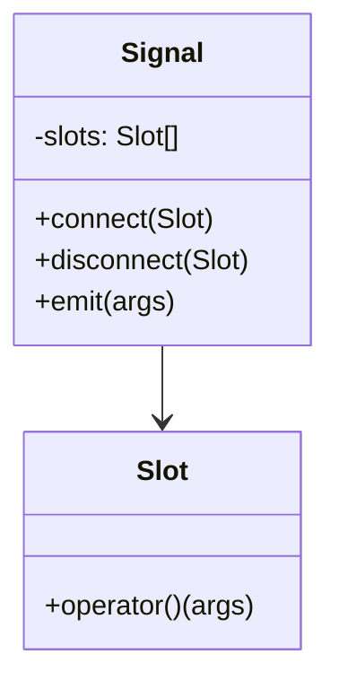

## Introduction
The Signal/Slot pattern is a type of event handling pattern used in software design to facilitate communication between objects. The pattern is especially useful in cases where an object needs to notify other objects of an event, without knowing or caring which objects will receive the notification.

In a typical software application, there are often many objects that need to communicate with each other. For example, a user interface might have a button that, when clicked, should trigger some action in another part of the program. Traditionally, this type of communication was achieved by implementing a callback function that was invoked when the event occurred. However, this approach can quickly become unwieldy and difficult to maintain as the number of objects and events grows.

The Signal/Slot pattern provides a solution to this problem by allowing objects to communicate with each other in a loosely coupled manner. In this pattern, an object (the signal) emits a signal when an event occurs, and other objects (the slots) that are interested in that event can register to receive the signal. When the event occurs, the signal notifies all registered slots, which can then take appropriate action.

## Example Scenario
Let's consider an example scenario where we have a class Sensor that represents a physical sensor. The Sensor class has a method readData() that reads data from the sensor and returns it. We also have a class Display that represents a display device. The Display class has a method showData() that displays the data on the device.

We want to create a system where the Sensor class can notify the Display class whenever new data is available. We can use the Signal/Slot pattern to achieve this.

## UML Design

In this diagram, Signal is the class that represents the signal, and Slot is the class that represents the slot.

## Implementation
```c++
#include <functional>
#include <vector>

template <typename... Args>
class Signal {
public:
    using SlotType = std::function<void(Args...)>;

    void connect(SlotType slot) {
        slots_.push_back(std::move(slot));
    }

    void disconnect(SlotType slot) {
        slots_.erase(std::remove(slots_.begin(), slots_.end(), slot), slots_.end());
    }

    void emit(Args... args) {
        for (auto& slot : slots_) {
            slot(args...);
        }
    }

private:
    std::vector<SlotType> slots_;
};
```

## Usage
```c++
class Foo {
public:
    void onSignal(int arg1, float arg2) {
        std::cout << "Foo received signal: " << arg1 << ", " << arg2 << std::endl;
    }
};

struct Bar {
    void operator()(int arg1, float arg2) const {
        std::cout << "Bar received signal: " << arg1 << ", " << arg2 << std::endl;
    }
};

int main() {
    Signal<int, float> signal;

    Foo foo;

    // Connect a member function of an object
    signal.connect(std::bind(&Foo::onSignal, &foo, std::placeholders::_1, std::placeholders::_2));

    // Connect a lambda function
    signal.connect([](int arg1, float arg2) {
        std::cout << "Lambda received signal: " << arg1 << ", " << arg2 << std::endl;
    });

    // Connect a function object
    Bar bar;
    signal.connect(bar);

    signal.emit(42, 3.14f);

    return 0;
}
```
#### Output
```
Foo received signal: 42, 3.14
Lambda received signal: 42, 3.14
Bar received signal: 42, 3.14
```

## Conclusion
The Signal/Slot pattern is a powerful design pattern that can be used to implement flexible and maintainable communication between objects. By using a Signal/Slot system, you can decouple the sender of a signal from the receiver, allowing for a more modular and extensible system.

In the example code provided, we saw how the Signal/Slot pattern can be implemented using the latest C++ standard features, including lambda functions, bound functions, and function objects. This implementation provides a flexible and convenient way to connect slots to signals, allowing for complex interactions between objects.

[Godbolt](https://godbolt.org/z/hcqhGMT7v)
